> Corrector: [TinyCorrect](https://gitee.com/tinylab/tinycorrect) v0.2-rc2 - [spaces tables]
> Author:    Siqi Fan <fansq19@lzu.edu.cn>
> Date:      20240830
> Revisor:   Falcon <falcon@tinylab.org>
> Project:   [RISC-V Linux 内核剖析](https://gitee.com/tinylab/riscv-linux)
> Sponsor:   PLCT Lab, ISCAS

# Epiphany 异常卡死问题分析 - Part1 锁定问题原因

## 概述

本文将深入探讨在使用 Epiphany 浏览器过程中遇到的异常卡死问题。我们会介绍 GUI 相关的概念，以及通过详细的步骤，展示如何诊断和锁定导致卡死的潜在原因。

## 问题描述

Epiphany（GNOME Web）是一款专门为 Linux 用户设计的知名开源网络浏览器。它简单、干净、漂亮、轻量，非常适合计算或存储资源紧张的设备。但是 epiphany-browser 被观察到在树莓派、Windows 虚拟机等场景下访问 Web 网站时存在必现的卡死问题，该问题严重影响到该浏览器的使用体验。

具体表现如下图所示，浏览器界面虽然可以正常启动，但在尝试访问任何网页时，浏览器会立即陷入无响应状态，网页无法加载，浏览器窗口只显示空白屏幕。无论等待多长时间，页面都无法显示内容，用户只能通过强制关闭浏览器来终止这个无响应状态。

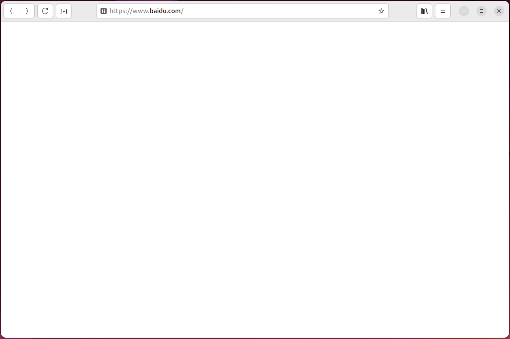

## 图形界面 GUI 相关概念

为了有效分析并解决这一问题，我们首先需要补充一些关键的基础知识。以下是 Linux 系统中与图形相关的软件层次结构图。

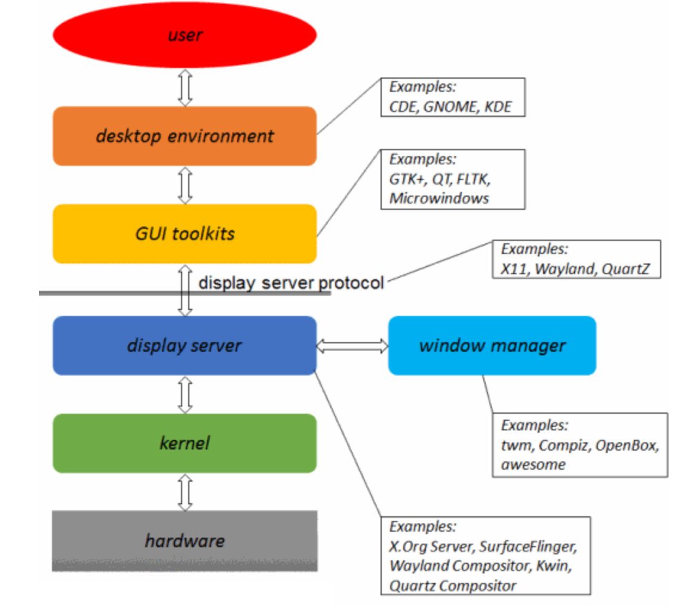

我们首先从 **Display Server Protocol** 开始讲解。大家熟悉的 X Window System（也称为 X、X11 或 X-Windows）其实是一种协议，类似于 HTTP 或 IP 协议，并不是一个具体的软件。协议需要通过具体的软件来实现，这就引出了图中所示的 **Display Server**，例如 X.Org Server 和 Wayland Compositor 等。X-Server（X.Org）是 Linux 系统在 PC 时代使用比较广泛的 Display Server，而 Wayland Compositor 则是新设计的，计划取代 X-Server 的一个新的 Display Server。

X11 提供了一个基础设施，用于创建和管理图形用户界面（GUI）。例如，它负责在显示设备上绘制基本的图形单元（如点、线、面等）以及处理与鼠标键盘等输入设备的交互。然而，X11 并未直接实现 UI 设计所需的按钮、菜单、窗口标题栏样式等元素。这些元素的实现通常由第三方应用程序来完成。这些应用程序主要包括：窗口管理器（window manager）、GUI 工具集（GUI widget toolkit）和桌面环境（desktop environment）。

**Window Manager** 负责控制应用程序窗口的布局和外观，使每个应用程序窗口尽可能以统一、一致的方式呈现给用户。例如，针对 X 的一个简单窗口管理程序是 twm (Tab Window Manager)。

GUI Widget Toolkit 是对 Windowing System 的进一步封装。以 X 为例，通过 xlib 提供给应用程序的 API 仅能绘制基本的图形单元（如点、线、面等）。要将这些基本的图形单元组合成复杂的应用程序，还需要完成许多细碎而繁琐的任务。因此，一些操作系统在 X 的基础上封装了更为便利的 GUI 接口，方便应用程序使用。例如 Microwindows、GTK+ 和 Qt 等等。

**Desktop Environment** 则是应用程序级别的进一步封装。通过提供一系列界面一致、操作方式统一的应用程序，桌面环境使系统能够以更为友好的方式向用户提供服务。Linux 系统中较为主流的桌面环境包括 GNOME、KDE 等等。而我们本文中涉及的 Epiphany 浏览器是 GNOME 桌面环境的浏览器。

那么接下来，我们熟知的 OpenGL 又是什么呢？以 X Window 为例，将上图中的 hardware、kernel 和 Display Server 层级展开如下：

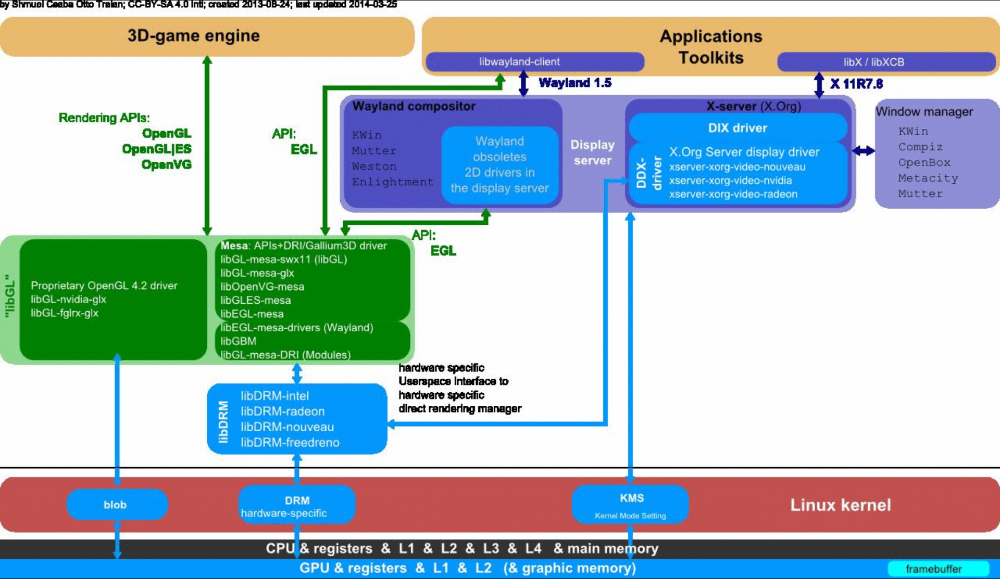

从上到下，图中包括如下的软件模块：

1.  3D-game engine、Applications 和 Toolkits，应用软件，其中 3D-game engine 是 3D application 的一个特例。

2. libX/libXCB 和 libwayland-client

   Display Server 提供给 Application（或者 GUI Toolkits）的、访问 server 所提供功能的 API。libX/libXCB 对应 X-server，libwayland-client 对应 Wayland Compositor。

3. Display Server

   图片给出了两个 Display Server：Wayland Compositor 和 X-Server（X.Org）。X-Server 是 Linux 系统在 PC 时代使用比较广泛的 Display Server，而 Wayland Compositor 则是新设计的，计划在移动时代取代 X-Server 的一个新的 Display Server。

4. Mesa

   Mesa 是一个开源的图形库，它实现了 OpenGL 标准的开源版本。Mesa 可以在没有专有硬件驱动程序的情况下，提供 OpenGL 支持。在不支持硬件加速的环境下，Mesa 可以通过 CPU 模拟 OpenGL 功能，即 LLVMpipe。

5. libDRM 和 Kernel DRM

   DRI（Direct Render Infrastructure）的 kernel 实现，及其 library。X-server 或者 Mesa 3D，可以通过 DRI 的接口，直接访问底层的图形设备（如 GPU 等）。

6. KMS（Kernel Mode Set）

   一个用于控制显示设备属性的内核驱动，如显示分辨率等。直接由 X-server 控制。

## 定位影响范围

### 复现卡死现象

在问题的初期阶段，我们并没有明确的方向，因此选择了几个不同版本的 Ubuntu 进行尝试。进行初步测试后，实验结果如表所示：自己下载的 Ubuntu 24.04 和 Ubuntu 22.04 均未能复现该问题，而使用 Linux Lab 的 Ubuntu 22.04 时则出现了卡死现象。

|   | Linux 发行版              | 问题情况 |
|---|--------------------------|--------|
| 1 | 新安装的 Ubuntu 24.04     | 正常     |
| 2 | 新安装的 Ubuntu 22.04     | 正常     |
| 3 | Linux Lab 的 Ubuntu 22.04 | 卡死     |

情况 2 和 3 的对比图展示如下：

<div style="display: flex; justify-content: space-around; align-items: center;">
    <div style="text-align: center;">
        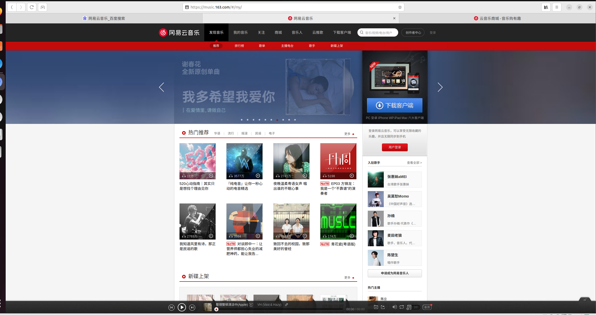
        <div>新安装的 Ubuntu 22.04</div>
    </div>
    <div style="text-align: center;">
        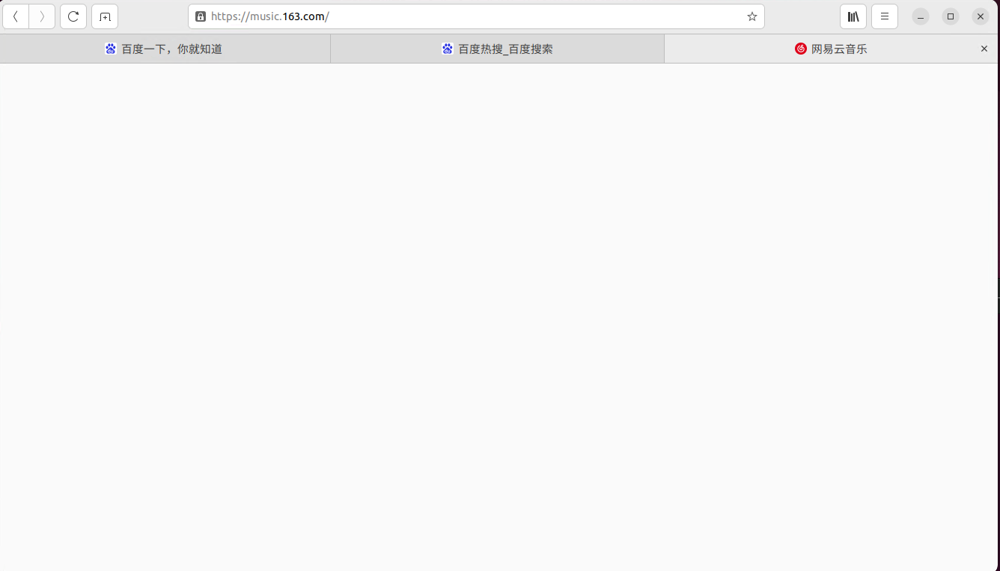
        <div>Linux Lab 的 Ubuntu 22.04 （出现卡死）</div>
    </div>
</div>

### 筛查问题

由于是 “Linux Lab 的 Ubuntu 22.04” 出现了卡死问题，我们决定将与其环境最为接近的 “新安装的 Ubuntu 22.04” 进行对比，试图找出两者之间的差异。我们推测，这些差异可能正是导致卡死问题的根源。为了更简洁地表达，我们将 “新安装的 Ubuntu 22.04” 简称为 Good Ubuntu，而 “Linux Lab 的 Ubuntu 22.04” 简称为 Bad Ubuntu。在接下来的分析中，我们将深入探讨这两种环境下的不同之处，以明确问题的具体原因。

我们设计对比了以下几个可能与卡死有关的内容：

|        对比内容        |
|:----------------------:|
| epiphany-browser 版本  |
|     libwebkit2gtk      |
| GPU 驱动提供的设备接口 |
|          内核          |
|    Windowing System    |

#### 软件版本

epiphany-browser 及其依赖 libwebkit2gtk 版本的不同会导致行为的不同。

Good Ubuntu 和 Bad Ubuntu 都是同样的 Ubuntu 22.04，软件包的版本肯定是相同的。因此排除软件版本问题。

> Epiphany 的浏览器内核是 WebKit。`libwebkit2gtk` 是 WebKitGTK 的核心库，用于在 GTK 应用程序中嵌入和渲染 Web 内容。GTK 是一个开源的跨平台 GUI（图形用户界面）工具包，其他的有 Qt、AWTK 等等。

#### GPU 驱动提供的设备接口

**猜测：**

我们猜测两个系统的 GPU 驱动程序可能提供了不同的设备接口，从而导致了卡死问题。

**比对：**

执行以下命令以检查 GPU 驱动提供的设备接口：

```bash
ls /dev/dri/
ls /dev/dri/renderD128
```

结果如下：

- Good Ubuntu:

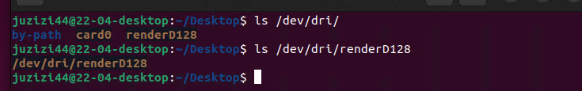

- Bad Ubuntu:

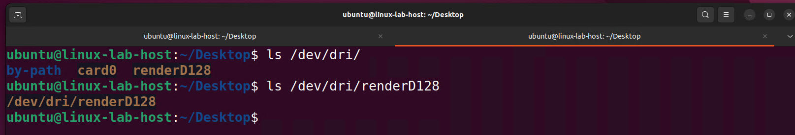

> `/dev/dri/renderD128` 是由 GPU 驱动程序提供的设备接口。它是 Direct Rendering Interface（DRI）的一部分，用于直接访问 GPU，以实现高效的图形渲染。

**结论：**

通过对比两个系统的设备接口，发现它们没有差异，这否定了我们的猜测。

#### Linux 内核

**猜测：**

我们推测系统卡死问题可能与 Linux 内核版本差异有关。

**比对：**

- Good Ubuntu 内核版本为 6.5.0

- Bad Ubuntu 内核版本为 5.15.0

**进一步验证：**

为了更深入地验证是否是内核版本导致的问题，我们对 Bad Ubuntu 进行了升级操作。在进行此操作前，我们首先对 Bad Ubuntu 进行了快照备份，然后使用以下命令将其内核升级到与 Good Ubuntu 一致的版本：

```bash
sudo apt install linux-generic-hwe-22.04
```

然而，升级后发现卡死问题在 Bad Ubuntu 中依然存在。由此可以得出结论：该问题与内核版本无关。

#### Windowing System

**猜测：**

可能是 Windowing System 引发的问题。

> Windowing System 是一种管理计算机图形用户界面的技术，它负责在显示器上创建和管理窗口，以便用户可以与应用程序交互。窗口系统提供了基本的图形界面功能，如窗口的创建、显示、移动、调整大小以及窗口之间的层次关系等。

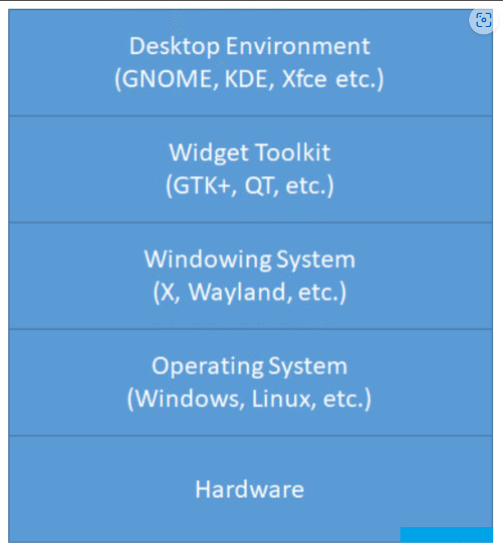

**验证：**

- Good Ubuntu：使用 Wayland。

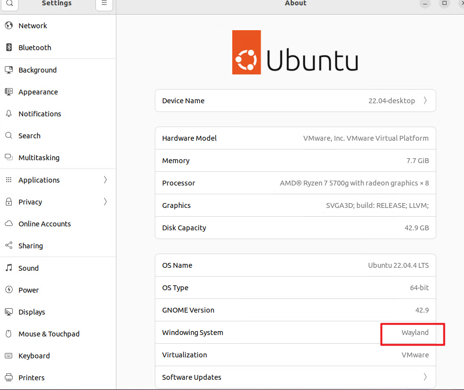

- Bad Ubuntu：使用 X11。

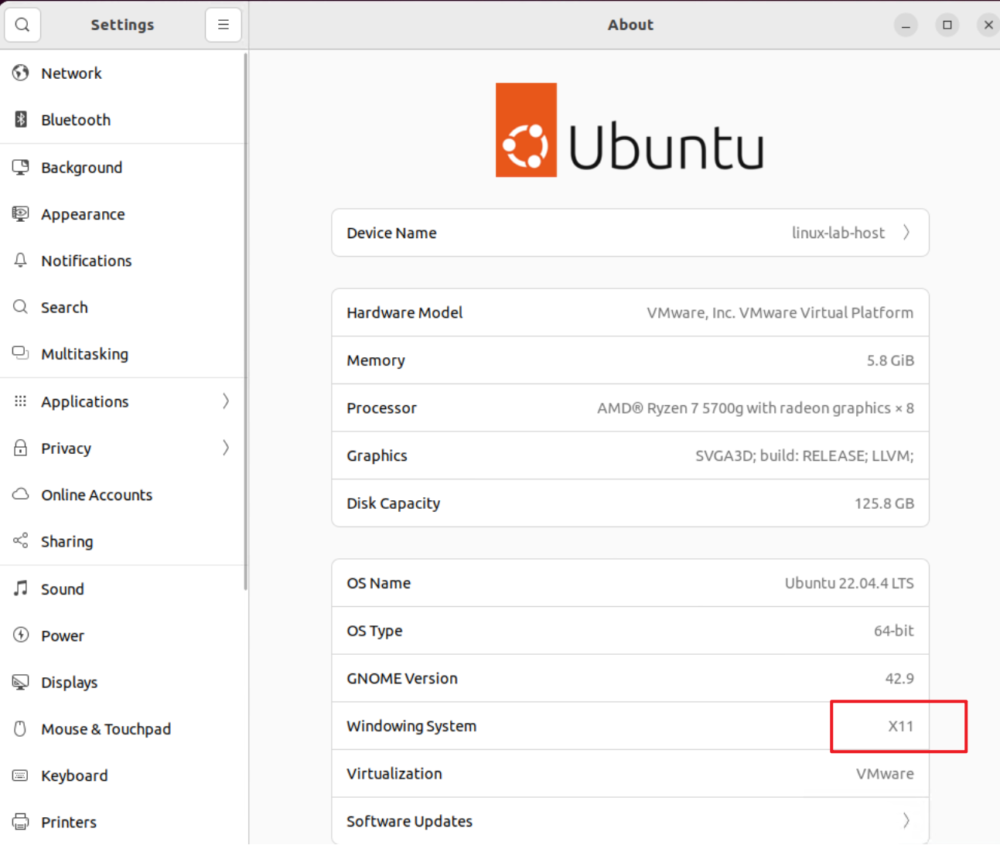

##### 进一步验证

为了进一步确认是否 X11 是导致问题的根源，我们将 Bad Ubuntu 的桌面环境切换到 Wayland：

1. **修改 GDM 配置：**
   编辑 GDM（GNOME Display Manager）的配置文件，将 Windowing System 设置为 Wayland。

   ```bash
   sudo vim /etc/gdm3/custom.conf
   ```

   在配置文件中，在 `[daemon]` 下增加行：

   ```bash
   WaylandEnable=true
   ```

2. **重启 GDM 服务：**
   修改配置文件后，重启 GDM 服务以使更改生效。

   ```bash
   sudo systemctl restart gdm3
   ```

3. **观察结果：**
   在将桌面环境切换到 Wayland 后，我们发现系统不再出现卡死问题。

**结论：**

通过将 Bad Ubuntu 的桌面环境切换至 Wayland 并观察到卡死问题消失，可以初步确认 X11 系统在此问题中存在重大嫌疑。进一步的分析和测试需要聚焦于 X11。

### 继续收缩情况

- 在发现 X11 可能是问题的根源后，我们进行了大量实验以进一步确认这一点，并测试了不同版本的 Ubuntu 和虚拟机环境。以下是实验结果：

  | 序号 | 虚拟机     | Linux 发行版   | 窗口系统 | 问题情况 |
  |------|------------|----------------|----------|---------|
  | 1    | VMware     | Ubuntu 22.04   | Wayland  | 无       |
  | 2    | VMware     | Ubuntu 22.04   | X11      | 卡死     |
  | 3    | VMware     | Ubuntu 24.04   | Wayland  | 无       |
  | 4    | VMware     | Ubuntu 24.04   | X11      | 卡死     |
  | 5    | VirtualBox | Ubuntu 24.04   | Wayland  | 无       |
  | 6    | VirtualBox | Ubuntu 24.04   | X11      | 卡死     |
  | 7    | VMware     | Debian Testing | X11      | 无       |

**实验观察：**

1. **虚拟机影响验证：**
   我们在 VirtualBox 上进行了实验（情况 5、6），发现即使在 VirtualBox 环境下使用 X11 也会出现卡死问题，这表明虚拟机本身并非导致问题的根源。

2. **Linux 发行版影响：**
   在不同的 Linux 发行版上进行测试（情况 2、4、6），发现使用 X11 时，Ubuntu 22.04 和 24.04 均会出现卡死现象。然而，在 Debian Testing（情况 7）中使用 X11 时并未出现卡死问题。Debian 和 Ubuntu 环境相似，最大的区别是包的版本不同。Debian Testing 是使用的最新的软件包版本。这一发现表明，某个新版本的驱动程序或浏览器组件可能已解决了该问题。

**结论：**

通过以上验证，我们确认了 X11 的影响。Wayland 环境下没有卡死问题，X11 下 100% 复现。

**后续步骤：**

Debian Testing 在使用 X11 时没有出现卡死现象，表明该版本可能包含了修复相关问题的更新。接下来的工作将集中于分析 Debian Testing 中引入的更改，以确定是哪一部分的驱动程序或组件进行了修复。

## 问题分析

为了找到 Debian Testing 是怎么修复的卡死问题，我们对比了 Debian Testing 和 Ubuntu 24.04 的以下几个方面：

### 浏览器版本

首先，我们对 Debian Testing 中的浏览器版本进行了检测，发现其版本为 46.2-1。为验证这一版本是否解决了卡死问题，我们将 Ubuntu 环境中的浏览器版本升级至相同的 46.2-1。

> 遇到的问题：
>
> - Epiphany 编译完成后遇到了 `bwrap: No permissions to creating new namespace`，解决方法是彻底关闭 `apparmor`。

然而，升级后卡死问题依然存在。因此浏览器版本与该问题无关。

### 驱动版本

- 起初，我们怀疑问题可能与 VMware 的显卡驱动有关。由于这些驱动可能是闭源的，我们未深入研究。然而，后来有同伴提到，如果树莓派也遇到类似问题，那可能是由于其显卡驱动实现不完全。这一信息进一步增强了我们对 VMware SVGA3D 显卡驱动的怀疑。

- 在进一步的调查中，我们发现 VMware 的 SVGA3D 驱动实际上是包含在 Mesa 图形库中的。因此我们可以对比 Ubuntu 和 Debian Testing 的 Mesa 版本。

- 通过运行 `glxinfo | grep Mesa` 命令，我们获取了 Mesa 版本信息：

  - **Ubuntu 24.04（出现卡死）：**
    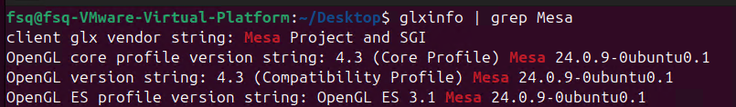

  - **Debian Testing（未出现卡死）：**
    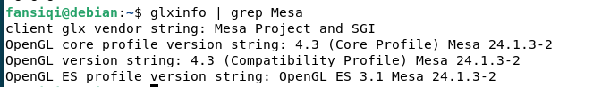

  从结果可以看出，两者的 Mesa 版本确实存在差异。

- 在 Ubuntu 24.04 上编译安装 Debian Testing 的 Mesa 版本 24.1.3 后，卡死问题不再出现。进一步二分收缩，发现 Mesa 版本 24.1.0 解决了卡死问题。

**结论：**
Mesa 版本 24.1.0 解决了 X11 下的卡死问题。

## 总结

本文分析了 Epiphany 浏览器在特定 Linux 环境下出现的卡死问题。通过对比不同的 Ubuntu 版本、内核、GPU 驱动以及窗口系统，最终确定问题的根源主要与 X11 窗口系统相关。在使用 X11 时，浏览器出现无响应现象，而当切换到 Wayland 窗口系统后，卡死现象完全消失。这一发现表明，Epiphany 浏览器在 X11 下的某些实现可能存在问题，尤其是在特定的 Ubuntu 版本或配置下。进一步的测试显示，X11 在多个不同环境中都导致了类似的问题，但在 Debian Testing 系统中使用 X11 时，未出现卡死现象，说明该版本可能已包含修复此问题的更新或优化。继续探究发现，是 Mesa 版本 24.1.0 解决了 X11 下的卡死问题。

## 参考资料

[1] Linux graphic subsytem(1)_概述 http://www.wowotech.net/graphic_subsystem/graphic_subsystem_overview.html

[2] linux 图形界面层次关系总结 https://blog.csdn.net/liyangbing315/article/details/4767363
